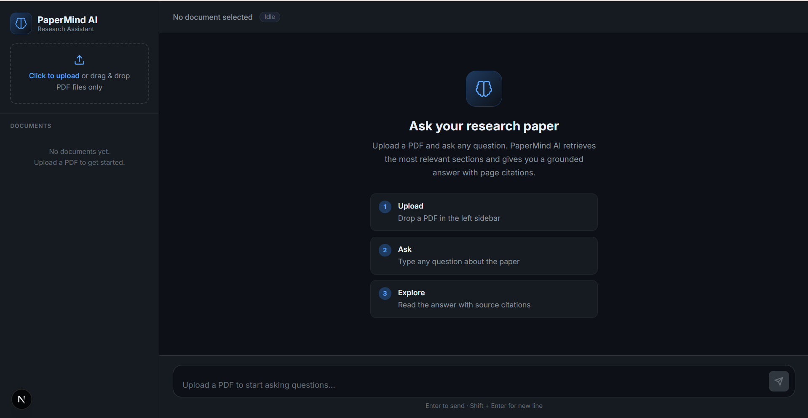
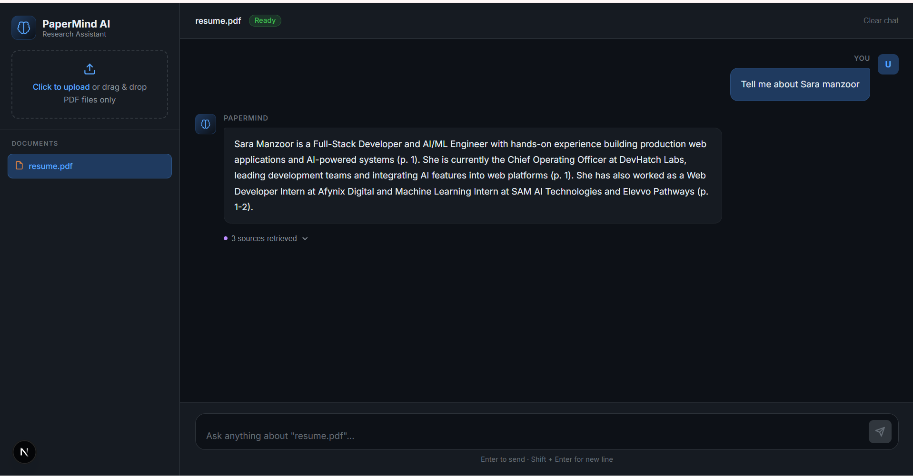
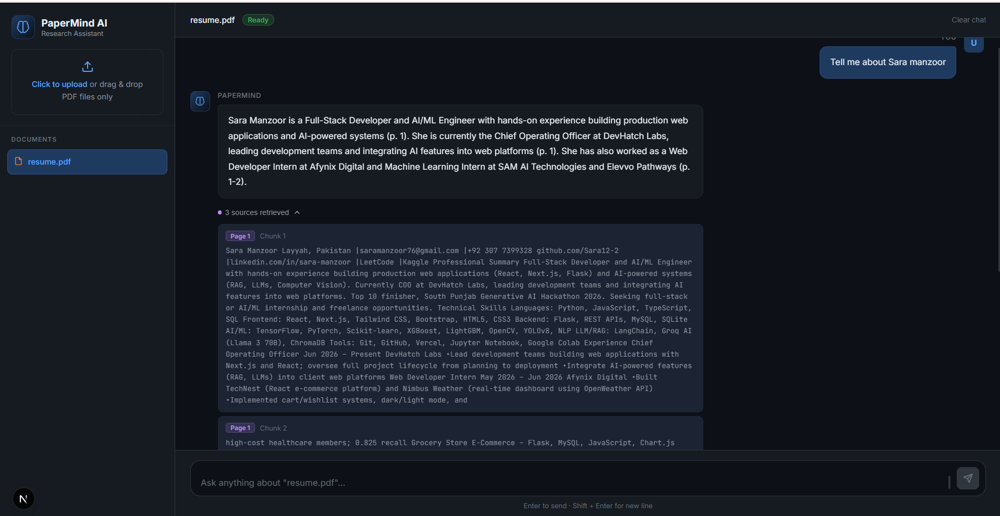
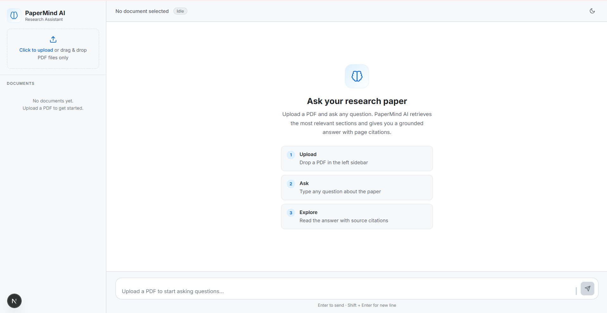
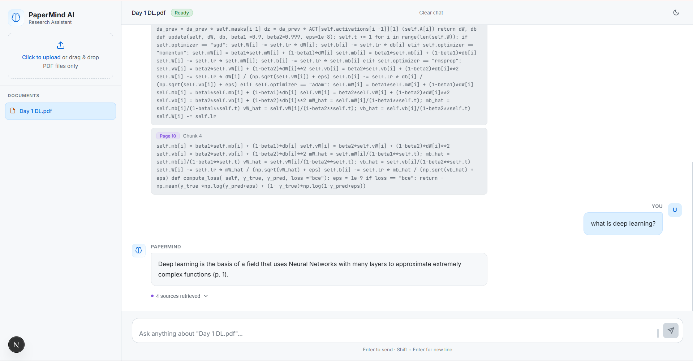
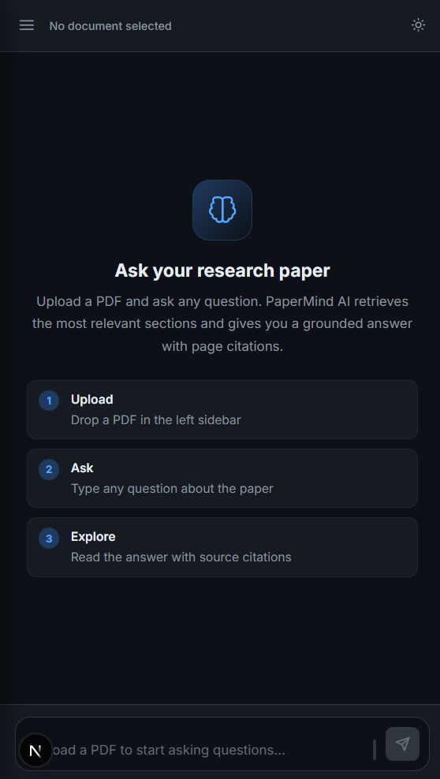
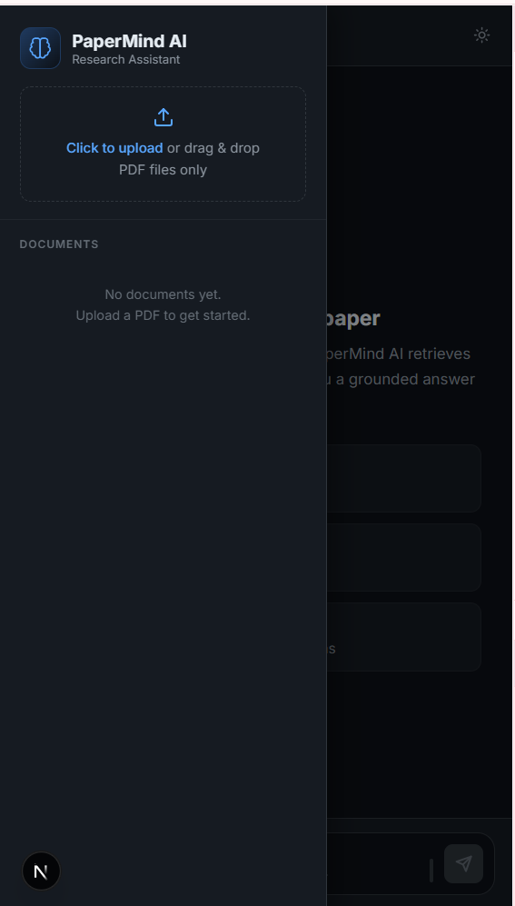
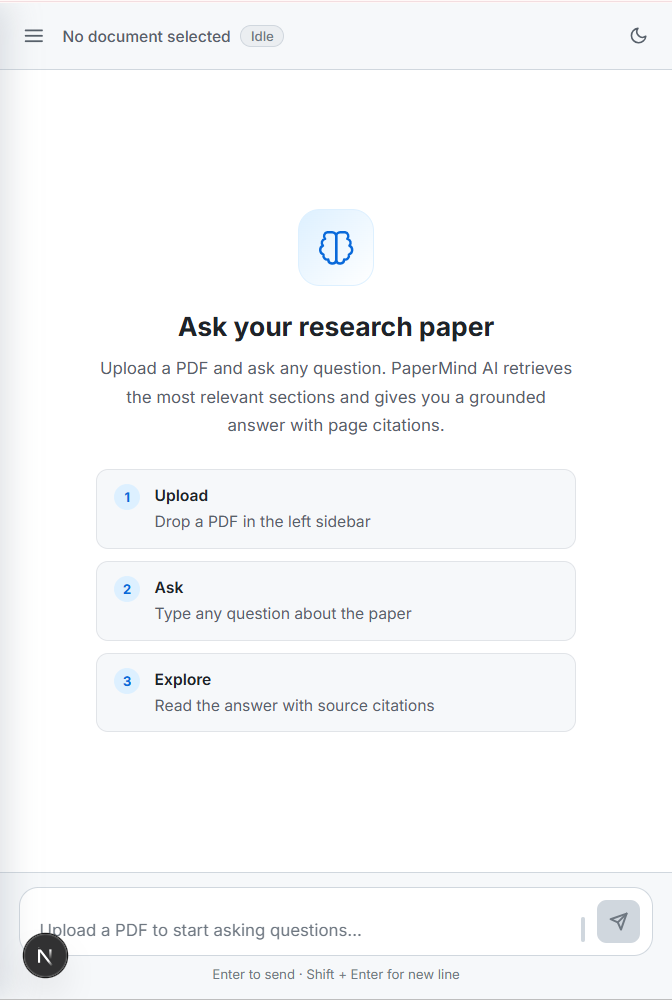
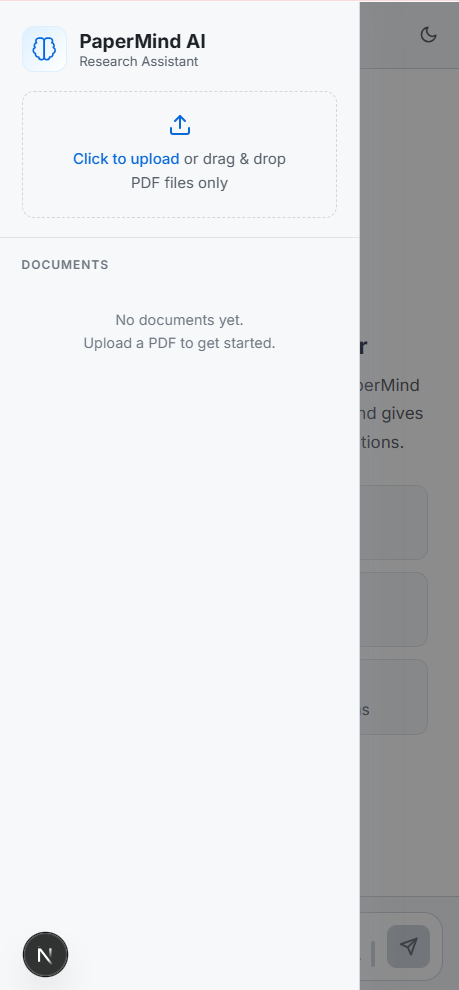

# PaperMind AI

<div align="center">


</div>

A retrieval-augmented Q&A tool for research papers. Upload a PDF, ask questions
about it in plain English, and get answers grounded in the actual document text,
with page-number citations — not the model's general knowledge.

## Table of contents

- [Features](#features)
- [Tech stack](#tech-stack)
- [Architecture](#architecture)
- [Prerequisites](#prerequisites)
- [Setup](#setup)
- [Environment variables](#environment-variables)
- [API reference](#api-reference)
- [Project structure](#project-structure)
- [RAG pipeline internals](#rag-pipeline-internals)
- [Limitations](#limitations)
- [Troubleshooting](#troubleshooting)
- [Security notes](#security-notes)

---
## Screenshots

### Home Page


### Working Example 1


### Working Example 2


### Home Light Theme


### Working Light Theme


### Responsiveness Dark 1


### Responsiveness Dark 2


### Responsiveness Light 1


### Responsiveness Light 2

## Features

- Drag-and-drop or click-to-upload PDF ingestion (25MB max)
- Multi-document support — upload several PDFs, switch between them, chat history
  resets per document
- Answers are grounded strictly in the uploaded document (the model is instructed
  not to use outside knowledge) and cite the page number of every fact used
  (`(p. 3)` style inline citations)
- Expandable "sources" panel under each answer showing the exact retrieved
  excerpts and which page they came from
- Toast notifications for upload errors/success (file-type/size validation)
- App-crash error boundary with a recoverable "reload" screen instead of a blank
  page
- Light/dark theme toggle (topbar sun/moon icon), persisted to `localStorage`,
  no flash of the wrong theme on load
- Fully responsive — below 900px the sidebar becomes an off-canvas drawer
  (hamburger toggle + backdrop), auto-closing when you pick a document
- Smooth animations throughout — message/document entrance, drawer slide,
  theme cross-fade, icon-button press feedback
- Fully local retrieval — no external API calls or cost for embeddings; only the
  final answer-generation call goes to a hosted LLM (Groq)

## Tech stack

**Frontend**
- [Next.js](https://nextjs.org) 16 (App Router) + React 19
- Plain CSS (custom properties, light + dark theme, no framework)
- Native `fetch` for API calls — no axios/SWR/React Query

**Backend**
- [Flask](https://flask.palletsprojects.com) 3 + Flask-CORS
- [PyPDF2](https://pypdf2.readthedocs.io) — per-page PDF text extraction
- [sentence-transformers](https://www.sbert.net) (`all-MiniLM-L6-v2`) — local
  embedding model, runs on CPU via PyTorch, no API key or network call required
  at query time
- [scikit-learn](https://scikit-learn.org) / NumPy — cosine-similarity retrieval
- [Groq](https://groq.com) (`llama-3.1-8b-instant` by default) — the only
  networked/paid dependency, used solely for the final answer synthesis step

## Architecture

```
┌──────────────┐   upload PDF    ┌───────────────────────────────────────────┐
│              │ ──────────────▶ │  Flask /upload                             │
│   Next.js    │                 │   1. PyPDF2 extracts text per page         │
│   frontend   │                 │   2. chunker splits into overlapping       │
│  (port 3000) │                 │      windows, tagged with page number      │
│              │                 │   3. sentence-transformers embeds each     │
│              │                 │      chunk, kept in an in-memory store     │
│              │ ◀────────────── │      keyed by a generated doc_id           │
│              │  { doc_id }     └───────────────────────────────────────────┘
│              │
│              │   ask question  ┌───────────────────────────────────────────┐
│              │ ──────────────▶ │  Flask /ask                                │
│              │                 │   1. question is embedded the same way     │
│              │                 │   2. cosine similarity ranks stored chunks │
│              │                 │      for that doc_id, top 4 selected       │
│              │                 │   3. those excerpts + question are sent    │
│              │                 │      to Groq with a grounding system       │
│              │                 │      prompt (cite page numbers, don't      │
│              │ ◀────────────── │      use outside knowledge)                │
│              │ { answer,       └───────────────────────────────────────────┘
│              │   sources[] }
└──────────────┘
```

Everything server-side is a single Flask process with an in-memory Python dict
as the "database" — there's no Postgres/Redis/vector DB. This keeps the project
dependency-free and easy to run locally, at the cost of persistence (see
[Limitations](#limitations)).

## Prerequisites

- Python 3.11+ and pip
- Node.js 18+ and npm
- A free [Groq API key](https://console.groq.com/keys) (required for `/ask` to
  work — `/upload` works without one)

## Setup

### Backend

```bash
cd backend
pip install -r requirements.txt
cp .env.example .env      # then edit .env and set GROQ_API_KEY
python app.py
```

Starts on `http://localhost:5000`. The first request that touches the embedding
model will download `all-MiniLM-L6-v2` (~90MB) from Hugging Face and cache it
locally (`~/.cache/huggingface`) — subsequent runs are instant and fully offline
for retrieval.

### Frontend

```bash
cd frontend
npm install
npm run dev
```

Starts on `http://localhost:3000`. Reads the backend URL from
`frontend/.env.local` (see below) — it already defaults to
`http://localhost:5000` if that file is missing.

Open `http://localhost:3000`, upload a PDF, and start asking questions.

## Environment variables

### `backend/.env`

| Variable | Default | Required | Description |
|---|---|---|---|
| `GROQ_API_KEY` | — | Yes (for `/ask`) | Your Groq API key. `/upload` works without it; `/ask` returns a `502` with a clear error message if it's missing. |
| `GROQ_MODEL` | `llama-3.1-8b-instant` | No | Any Groq-hosted chat model id. |
| `EMBEDDING_MODEL` | `sentence-transformers/all-MiniLM-L6-v2` | No | Any sentence-transformers model name/path. |
| `CORS_ORIGINS` | `http://localhost:3000` | No | Comma-separated list of allowed origins. |
| `PORT` | `5000` | No | Port the Flask dev server binds to. |

### `frontend/.env.local`

| Variable | Default | Description |
|---|---|---|
| `NEXT_PUBLIC_API_URL` | `http://localhost:5000` | Base URL the frontend calls for `/upload` and `/ask`. Must be prefixed `NEXT_PUBLIC_` to be readable in the browser bundle. |

Both `.env` files are gitignored — only the `.env.example` templates are
committed.

## API reference

### `GET /health`

Returns `{"status": "ok"}`. No auth, no body.

### `POST /upload`

`multipart/form-data` with a single field `file` (PDF, ≤25MB).

**Success — `200`**
```json
{ "doc_id": "a1b2c3...", "message": "\"paper.pdf\" processed — 12 pages, 34 chunks indexed." }
```

**Errors**
| Status | Cause |
|---|---|
| `400` | No file provided, or file isn't `application/pdf` |
| `413` | File exceeds 25MB (enforced by Flask's `MAX_CONTENT_LENGTH`) |
| `422` | PDF has no extractable text (e.g. a scanned/image-only document — there's no OCR) |

### `POST /ask`

`application/json`: `{ "question": string, "doc_id": string }`

**Success — `200`**
```json
{
  "answer": "The maximum upload size is 25MB (p. 2).",
  "sources": [
    { "text": "...chunk text...", "page": 2 },
    { "text": "...chunk text...", "page": 1 }
  ]
}
```

**Errors**
| Status | Cause |
|---|---|
| `400` | Missing/empty `question` |
| `404` | Unknown or expired `doc_id` (e.g. the backend restarted since upload) |
| `502` | Groq call failed — missing/invalid `GROQ_API_KEY`, rate limit, or model error. The `error` field contains the underlying message. |

## Project structure

```
backend/
  app.py                 Flask app: /health, /upload, /ask routes, CORS, upload size limit
  requirements.txt
  .env.example
  rag/
    pdf_utils.py          PyPDF2 wrapper: PDF -> [{page, text}, ...] per non-empty page
    chunker.py             [{page, text}] -> overlapping 180-word chunks (30-word overlap)
    embedder.py             sentence-transformers wrapper, lazy-loaded singleton model
    store.py                 in-memory {doc_id: {chunks, vectors}}, cosine-similarity top-4 retrieval
    llm.py                    Groq client wrapper, grounding system prompt, answer generation

frontend/
  app/
    layout.js              root layout — theme-init script, ErrorBoundary, ThemeProvider, ToastProvider
    page.js                 main page — composes Sidebar / ChatArea / InputBar, owns mobile drawer state
    globals.css             design tokens (light + dark CSS vars), responsive breakpoints, animations
  components/
    Sidebar.jsx              logo, upload zone, document list — also the mobile drawer
    UploadZone.jsx            drag/drop + click-to-upload, client-side type/size validation
    DocItem.jsx                single document row (select / remove)
    ChatArea.jsx               message list + auto-scroll + typing indicator
    MessageBubble.jsx          single message, expandable sources toggle
    SourceCard.jsx              one retrieved excerpt (page badge + text)
    WelcomeScreen.jsx           empty-state instructions
    InputBar.jsx                textarea (auto-resize) + send button
    Icons.jsx                   shared inline SVG icons (brain, send, upload, file, x, chevron, sun, moon, menu)
    ErrorBoundary.jsx           class component, catches render crashes
  context/
    ToastContext.jsx           toast notification provider/hook
    ThemeContext.jsx            light/dark theme provider/hook, persists to localStorage
  hooks/
    useDocuments.js             upload/select/remove document state + validation
    useChat.js                   message state, sends questions, scoped to active doc
  services/
    api.js                      uploadPDF() / askQuestion() — the only two fetch calls in the app

docs/
  Overview.md, Architecture.md, Backend.md, RAG Pipeline.md, Frontend.md,
  API Reference.md, Environment Variables.md, Troubleshooting.md
  — an Obsidian-ready vault of interlinked notes (open docs/ as a vault, or
  add it to an existing one). This is the deep-dive technical reference;
  this README stays focused on setup and quick reference.
```

## RAG pipeline internals

These are the actual constants in the code today (`backend/rag/chunker.py`,
`backend/rag/store.py`), in case you're tuning retrieval quality:

- **Chunking:** 180 words per chunk, 30-word overlap between consecutive
  chunks, chunk boundaries never cross a page (so every chunk has exactly one
  page number for citation)
- **Embedding model:** `all-MiniLM-L6-v2` (384-dim, normalized vectors)
- **Retrieval:** cosine similarity (dot product of normalized vectors) between
  the question embedding and every chunk embedding for that document; top 4
  chunks are sent as context
- **Generation:** Groq chat completion, `temperature=0.2`, `max_tokens=600`,
  with a system prompt instructing the model to answer only from the given
  excerpts, admit when the answer isn't in them, and cite page numbers inline

Document state (chunks + embeddings) lives in a plain Python dict in the Flask
process's memory — **restarting the backend clears every uploaded document**.
There's no database, no disk persistence, and no multi-worker support (running
under gunicorn with >1 worker would split documents across processes that don't
share memory).

## Limitations

- **No persistence** — restart the backend, lose all uploaded documents (see
  above)
- **No OCR** — scanned/image-only PDFs return a `422` since PyPDF2 can't
  extract text from images
- **No auth** — anyone who can reach the backend can upload documents or ask
  questions against any `doc_id`; fine for local dev, not for a public deploy
  as-is
- **Single-process only** — the in-memory store assumes one Flask worker
- **English-tuned embeddings** — `all-MiniLM-L6-v2` works across languages but
  is optimized for English; retrieval quality on non-English PDFs may be weaker
- **No streaming** — `/ask` waits for the full Groq response before replying;
  the UI shows a typing indicator but not token-by-token streaming

## Troubleshooting

| Symptom | Cause / fix |
|---|---|
| `/ask` returns `"GROQ_API_KEY is not set"` | Add your key to `backend/.env` (not `.env.example`) and restart `python app.py` |
| Upload succeeds but `/ask` says "Unknown document" | The backend restarted (or the reloader restarted it) since you uploaded — re-upload the PDF |
| CORS error in the browser console | `frontend`'s origin isn't in the backend's `CORS_ORIGINS` — check both are using the ports you expect (3000 / 5000) |
| First `/upload` request is slow | Expected once — it's downloading the ~90MB embedding model from Hugging Face. Subsequent requests are fast |
| `422 Couldn't extract any text` on upload | The PDF is likely scanned/image-only; there's no OCR step in this pipeline |
| `npm run dev` fails immediately with no compile output | Usually a Node version mismatch — this project was verified against Node 18+; very new or very old Node versions can behave unpredictably with Next.js's dev server |

## Security notes

- Never commit `backend/.env` or `frontend/.env.local` — both are gitignored,
  only the `.env.example` templates should be tracked
- The backend has no authentication or rate limiting — don't expose it directly
  to the internet without adding both
- Uploaded PDF content and questions are sent to Groq's API for the `/ask`
  step; don't upload documents you're not comfortable sending to a third-party
  LLM provider
