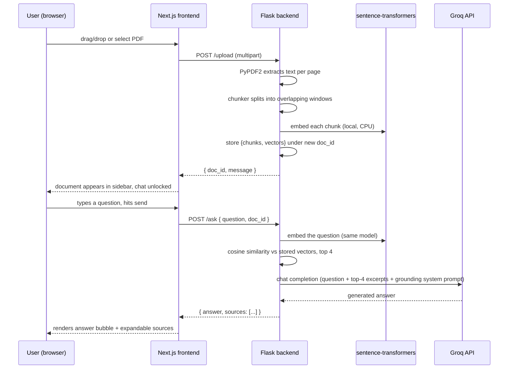

# Architecture

See [[Overview]] for what the project does. This note is about how the pieces
fit together.

## The big picture

Two independent processes, no shared database:

- **[[Frontend]]** — Next.js, port 3000, talks to the backend only over HTTP via `NEXT_PUBLIC_API_URL`
- **[[Backend]]** — Flask, port 5000, holds all document state **in a plain Python dict in process memory** — no Postgres, no Redis, no vector DB

That in-memory choice is the single most important architectural fact about
this project: it's what makes the whole thing dependency-free and easy to run
locally, and it's also the source of every limitation in [[RAG Pipeline#Limitations]].

## Request flow

## Why two separate embedding calls per question?

Each `/ask` re-embeds the question fresh (no caching) and compares it against
the chunk vectors already sitting in memory for that `doc_id`. Only the
question is embedded at ask-time; document chunks were already embedded once
at upload-time. See [[RAG Pipeline]] for the exact model and similarity math.

## Why Groq is the only external network dependency

Everything else — extraction, chunking, embedding, retrieval — runs locally on
CPU with no API key and no network call. Groq is used exclusively for the
final step: turning (question + retrieved excerpts) into a natural-language
answer. This keeps the app fully functional (upload + retrieval) even without
a Groq key; only `/ask`'s generation step needs one. See
[[Environment Variables#GROQ_API_KEY]].

## Process/deployment shape

- Single Flask worker, `debug=True`, `use_reloader=False` in dev (see [[Backend]])
- Running behind gunicorn with more than one worker would **break** document
  lookup, since each worker has its own separate in-memory dict — a `doc_id`
  uploaded to worker A would 404 on worker B. Fixing this would require moving
  the store out of process memory (Redis, SQLite, a vector DB) — out of scope
  for the current implementation.

## Related notes

[[Backend]] · [[RAG Pipeline]] · [[Frontend]] · [[API Reference]]
